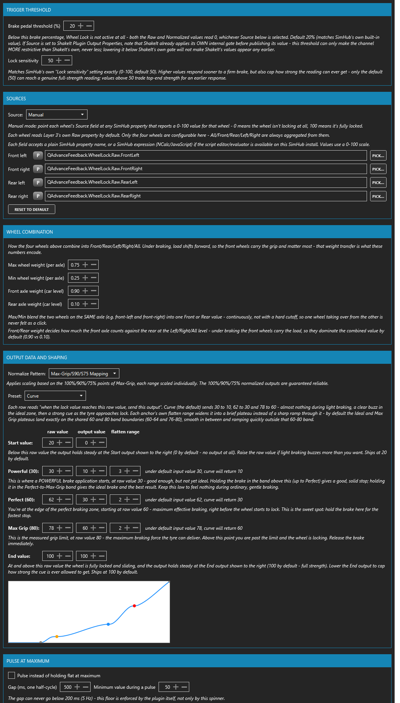
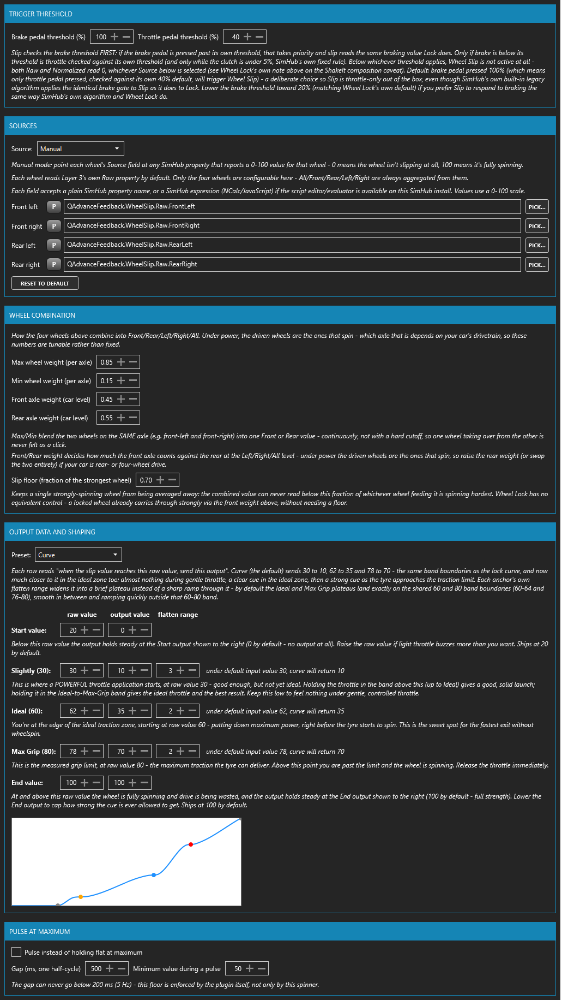
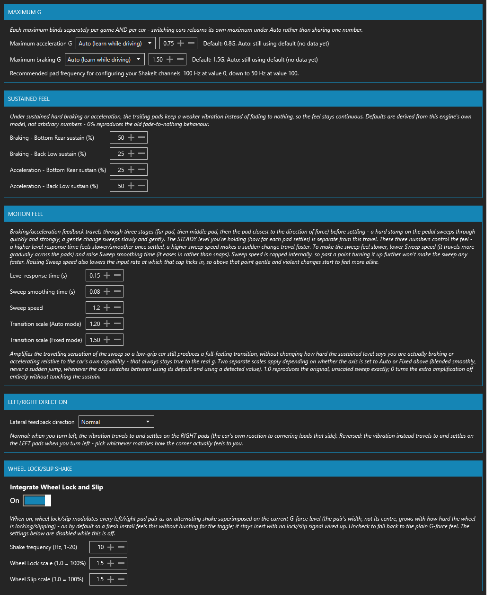
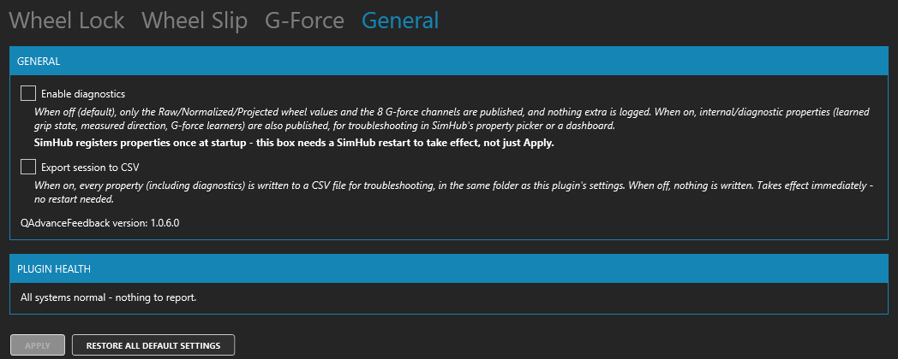

# QAdvanceFeedback

[English](README.md) · **简体中文**

一个 SimHub 插件，把车轮抱死、车轮打滑与 G 力都转换成真实的体感——车轮方面是一个**在任何车上含义都相同的 0-100 信号**，另外还提供 8 个独立的 G 力通道，服务于完整的座椅震动垫方案。

---

## 1. 这个插件能给你什么

### 可靠的车轮抱死与车轮打滑

每辆车的抓地力表现都不一样。GT 赛车的刹车抱死点和敞轮方程式赛车的脚感完全不同，原始的「这个轮子打滑了多少」这个数字在不同车上的含义也不一样——同样是 0.4，在一辆车上可能什么事都没有，在另一辆车上却已经是车轮即将完全失控的前一刻。这种不一致，正是原始打滑/抱死数值无法直接拿来驱动震动器的根本原因：换一辆车，你就得重新调一遍。

本插件的解决办法是：针对**每一款游戏、每一辆车**，学习这辆车在加速和刹车时实际能达到的最大抓地力。它持续观察你的车速、油门、刹车和 G 力，找出「这辆车」真正的极限在哪里，然后用这个学到的峰值，把默认发布为 `QAdvanceFeedback.WheelLock.Raw.*` 与 `QAdvanceFeedback.WheelSlip.Raw.*` 的逐轮原始信号，重新缩放成 `QAdvanceFeedback.WheelLock.Normalized.*` 与 `QAdvanceFeedback.WheelSlip.Normalized.*`——一个 0-100 的刻度，其区间在任何地方含义都相同：

| 区间 | 含义 |
|---|---|
| 0-30 | 低于力量阈值——轻度使用轮胎 |
| 30-60 | 动力刹车/加速——正逐步接近理想区间 |
| 60-80 | 理想区间，直到测得的抓地极限——数值越高越快，但风险也逐渐增加 |
| 80-100 | 超出极限——车轮正在抱死/打滑，请立即松开踏板 |

**80 是测得的抓地极限**——轮胎所能提供的最大刹车力或牵引力，并非每个弯角都会出现的数值，只有车轮真正达到这辆车自身的学习极限时才会出现。行驶初期读数可能略低于 80，这是暂时的冷启动现象；经过多次真正接近极限的操作后，读数会收敛到 80。

这个归一化后的数值随后还会再经过一次整形——通过一条你可以自行编辑的曲线，或者如果你更喜欢，也可以用简单的线性映射——最终变成 `QAdvanceFeedback.WheelLock.Projected.*` 与 `QAdvanceFeedback.WheelSlip.Projected.*`。**这一层属性才是你应该绑定到硬件上的那一层。** 之所以还要有曲线这一步，是为了让你能够独立于学习机制本身，精确决定 0-100 这个区间里的每一段应该转化成多强、多柔和的振动。

曲线上有三个命名设定点，每个都有自己可编辑的原始输入位置、输出强度，以及一个平滑范围：该设定点两侧多远的范围内（原始输入单位）会保持接近该点自身的输出值，而不是直接穿过它的斜坡，从而形成一小段近乎平坦的平台。默认值（3/2/2）使中间和最高的平台正好落在共享的 60/80 区间边界上，因此曲线在 60-80 这个理想区间内平滑过渡，在此区间之外则急剧上升或下降。将平滑范围设为 0 会让该设定点恢复为未平滑的尖锐拐点。曲线的起始和结束行也各自拥有可编辑的输出值（默认 0/100），而不再固定不变——提高起始输出值可以让存在死区的电机在通道启用后始终保持一个基础嗡鸣；降低结束输出值则可以将最强的提示限制在满强度以下。

**车轮抱死自己的分区标题是「输出数据与整形」，并且以一个归一化模式选择器开头**——车轮打滑没有对应的选择器，因为它始终使用映射式的公式：

- **最大抓地力/S90/S75 映射**（默认）根据最大抓地力的 100%/90%/75% 点分别应用缩放，每个区间独立缩放——100%/90%/75% 的归一化输出均可保证可靠。在这种模式下，三个设定点分别标记为**强劲（Powerful）**、**完美（Perfect）**和**最大抓地力（Max Grip）**。
- **仅最大抓地力**只根据最大抓地力点应用一次整体缩放——在此模式下只有最大抓地力的归一化输出可保证可靠。三个设定点改为标记**轻微（Slightly）**、**理想（Ideal）**和**最大抓地力（Max Grip）**，与本插件最初、更简单的曲线一致。

车轮打滑自己的三个设定点则始终标记为**轻微（Slightly）**、**理想（Ideal）**和**最大抓地力（Max Grip）**。

### 面向 8 通道震动垫的丰富 G 力输出

与车轮通道相互独立，本插件还在 `QAdvanceFeedback.GForce.*` 下计算一套完整的 8 通道 G 力信号，专为座椅/靠背震动垫设计，让驾驶者能真切感受到刹车、加速与过弯载荷分别作用在身体的哪个部位：

| 震动垫位置 | 对应身体部位 |
|---|---|
| TopBack | 上背部 |
| LowBack | 腰部/下背部 |
| BottomRear | 大腿根部 |
| BottomFront | 大腿远端 |

这套方案是为完整的 8 通道震动座椅/震动垫设计的——**NextLevelRacing HF-8**、**Razer Freyja**（该设备只有 6 个通道，因此需要把本插件的 8 个通道映射精简到 6 个），以及 **Sensit Haptics MTC-P Extreme 2** 均在支持范围内。

这种体感是一段动画，而不是一个静止的强度值。刹车时，震动会沿着 **LowBack → BottomRear → BottomFront** 的路径移动——从腰部开始，随着重心在刹车时前移，逐渐向下、向前推进到大腿；加速时则反过来，沿 **BottomRear → LowBack → TopBack** 移动——从大腿根部开始，把你向后、向上推入座椅靠背。而每当某个车轮在刹车时真正抱死，或在动力输出下真正打滑时，本插件还会在这套 G 力体感之上叠加一个左右交替的抖动——车子本身仿佛在你身下摇晃，就像现实中（或者非常出色的模拟中）一辆正处于抓地力极限边缘的车，透过座椅传递给你的真实感受一样。

---

## 2. 快速上手指南

你需要的一切都在 **[`docs/setup/`](docs/setup/)** 目录下。这里有两条路径，只有在你确实需要时才用得上进阶路径。

### 简单路径

1. 把 `QAdvanceFeedback.dll` 拷贝到你的 SimHub 目录，重启 SimHub。
2. 在 SimHub 的插件列表中启用 **QAdvanceFeedback** 插件。
3. 如果你使用的是 Simagic HPR 电机（或任何由 ShakeIt Motors 驱动的震动电机/低音震动器方案），导入 **[`QAdvanceFeedback - WheelLockSlip.siprofile`](docs/setup/QAdvanceFeedback%20-%20WheelLockSlip.siprofile)**；如果你使用 8 通道震动垫，导入 **[`docs/setup/G-Force/`](docs/setup/G-Force/)** 下与你设备匹配的配置文件。

到这里就结束了——在本插件自带的 Manual（手动）数据源下，车轮抱死/打滑与 G 力功能开箱即用，不需要在 SimHub 里做任何其他配置。

### 进阶路径

如果你更希望让车轮抱死/打滑读取 SimHub 自身的 ShakeIt 传统 iRacing 算法，而不是本插件内置的算法，请额外执行：

1. 启用 **ShakeIt Motors** 插件，并在其中导入同一个 `.siprofile` 文件——这样会生成本插件可以读取的 ShakeIt 传统 iRacing 车轮抱死/打滑属性。
2. 在本插件的 Wheel Lock / Wheel Slip 设置中，把数据源模式从 **「Manual」** 切换为 **「Use ShakeIt output properties」**。

无论你选择哪种数据源模式，曲线、脉冲和 G 力体感的其余部分表现完全一致。

完整的分步说明，包括 SimHub 菜单的确切文字与截图，见随包附带的设置指南：**[`docs/setup/Setup Guide 设置指南.txt`](docs/setup/Setup%20Guide%20%E8%AE%BE%E7%BD%AE%E6%8C%87%E5%8D%97.txt)**。

---

## 3. 调整体感

本插件在 SimHub 设置面板中有四个标签页：Wheel Lock、Wheel Slip、G-Force 和 General。下面是全部四个标签页的截图，随后是针对最值得调整的两个标签页的简短、实用建议。

**Wheel Lock**



**Wheel Slip**



**G-Force**



**General**



### Wheel Lock 与 Wheel Slip

- 想让振动更晚一点才触发？**调高触发阈值。**
- 想让某一根轴的影响更大？**调整车轮组合权重**——尤其是前/后轴的权重比例，值得根据你的车和个人喜好去调。
- 理想点附近的体感太强烈？**调低 Ideal 的输出值**，或者**把它对应的原始输入值调高一点**，让曲线这一段的反馈更柔和。
- 想让任意一个设定点附近的近平坦平台变长或变短？**调整该行的平滑范围**——范围越宽，对该点附近轻微踏板力度波动的容忍度越高；设为 0 则会恢复为尖锐拐点。
- 想让完全抱死/打滑的感觉比一成不变的嗡嗡声更紧迫？**启用「pulse instead of holding flat at maximum」**，在达到完全抱死/打滑后获得类似 ABS 的脉冲式体感。
- 只关心最大抓地力这一点，不需要 90%/75% 区间被单独缩放？**把车轮抱死的归一化模式切换为「仅最大抓地力」**——更简单，但此时只有最大抓地力的归一化输出可保证可靠。

### G-Force

- 如果你不想让插件自动学习你这辆车的最大 G 值，把最大 G 值**设为固定值**，而不是 Auto。
- 在 Auto 模式下，「Auto detected」（自动检测）读数会在设置面板打开期间每秒左右刷新一次，因此在你完成第一圈的途中就能看到真实数值，而不必等到下次重新打开面板。
- 想改变震动「保持」阶段的体感，**调整 sustain 百分比**。
- 想让整个动画的移动感觉更慢、更从容，或者更迅速？**调低 sweep speed** 可以让动画更缓慢，**调高**则更迅速。
- 默认情况下，右转弯时左侧的振动更强（也就是你被推向的那一侧）。如果你的装备感觉正好相反，**lateral feedback direction（横向反馈方向）** 设置可以把它反过来。
- 叠加在 G 力体感之上的车轮抱死/打滑抖动可以**完全关闭**，也可以通过 **shake frequency（抖动频率）** 和 **lock/slip scale（抱死/打滑强度）** 独立调节。

### General（常规）

- **General** 标签页会显示当前加载的插件 DLL 具体是哪个版本——便于在提交问题反馈或对照本发行说明时使用，旁边还有诊断/CSV 导出开关和插件健康面板。

---

## 4. 技术细节

完整的分层设计——每个子系统的职责、每个源文件的角色、韧性模型，以及把子系统降级状态呈现给驾驶者而不是悄悄隐藏起来的健康状态注册机制——都在 **[`docs/architecture.md`](docs/architecture.md)**（[中文版](docs/architecture.zh-Hans.md)）中。在修改任何算法或文件结构之前，请先阅读该文档；其中有一条硬性规定，要求它必须与代码保持同步。

概览如下，是每个子系统所依赖的机制，以及各自的用途：

| 子系统 | 核心算法/机制 | 用途 |
|---|---|---|
| **Wheel Lock Raw** / **Wheel Slip Raw** | 精确复现 SimHub 自身基于转速/车速的传统 iRacing 抱死与打滑公式（已通过反编译验证），按标题（游戏）在多个分支专用模型（车轮转速、车轮速度差值、预先标定的打滑、学习到的百分位分布，或在没有逐轮遥测数据时使用刹车+车速+转速的兜底方案）之间调度，由能力标志位决定选用哪个分支，再通过一套具有物理依据的 Max/Min 轴间混合与前后轴加权混合，按轮组合并。 | 忠实、未归一化地复现 SimHub 自身广为人知的算法——本插件其余一切内容都建立在这个共同基准之上。 |
| **Wheel Lock/Slip Normalizer** | 依据一个按（游戏、车辆、数据源）分别学习的物理抓地力峰值参考值（一个刻意缓慢收敛的 EMA，确保单次尖峰不会被误判为这辆车的真实极限），对 Raw 的逐轮数值形状重新缩放；再通过一个仅锚定在极少数、独立检测到的「正处于物理极限」时刻的学习器，按数据源分别做交叉标定；并根据本局实时证据的「一致程度」（而不仅仅是数量）在本局实时数据与持久化的历史数据之间做混合。 | 让「60」在任何车上都意味着同一件事——「正处于极限」——而不是一个含义会随这辆车抓地力好坏而漂移的数字。 |
| **Wheel Lock/Slip Projector** | 把归一化后的 0-100 数值送入一条驾驶者可编辑的五锚点曲线，并用单调三次插值平滑，确保输出值不会随输入上升而下降；此外还有一个可选的「达到最大值时脉冲」阶段。 | 把「这有多严重」这个数字，变成「它应该是什么样的体感」——唯一一层设计给震动器绑定使用的属性。 |
| **G-Force** | 一套仿「洗出（washout）」模型，把*持续*的 G 力水平与*由变化率驱动*的瞬态分开，因此上升中的 G 力会比同样大小的稳定 G 力，让体感在震动垫链条上走得更远；每款游戏/每辆车各自的最大值，通过一个基于修剪样本池的鲁棒估计器（剔除最高的一批离群值，再混合剩余样本池的最大值与均值）在一个实时滚动时间窗口内学习得到；车轮抱死/打滑还可以选择性地在其上叠加一个左右交替的抖动。 | 让座椅震动垫获得连续、有方向感的刹车/加速/过弯载荷体验，与车轮通道相互独立又彼此互补。 |

### 从源码构建

```bash
bash tools/fetch-simhub-refs.sh 9.11.22          # 把参考程序集解压到 lib/ 目录
MSBuild QAdvanceFeedback.sln -t:Restore,Build -p:Configuration=Release
dotnet test QAdvanceFeedback.Tests/QAdvanceFeedback.Tests.csproj
```

`lib/` 目录刻意不纳入版本控制——这些第三方 DLL 由 `tools/fetch-simhub-refs.sh` 从官方 SimHub 安装程序中重新提取，默认针对 SimHub 9.11.22。算法本身位于 `QAdvanceFeedback/Core/`，完全不依赖 SimHub，因此即使在一台没有安装 SimHub 的机器上也能完整测试。

**994 个测试，0 个编译警告，单 DLL 发布**（`bin\Release\net48\` 下只有 `QAdvanceFeedback.dll` 及其 `.pdb`）。

---

## 5. 版权、许可与参考资料

- **本插件是一个独立的第三方项目，与 SimHub 及其作者 Wotever（github.com/SHWotever/SimHub）没有任何隶属、授权或支持关系。**
- **构建本项目需要 SimHub 的参考程序集，但本仓库不会重新分发它们**——`lib/` 已被 git 忽略，`tools/fetch-simhub-refs.sh` 会为任何从源码构建的人，从官方 SimHub 安装程序中重新提取这些文件。
- Wheel Lock/Wheel Slip 的 Raw 算法刻意复现了 SimHub 自身 ShakeIt 传统 iRacing 车轮打滑效果的行为，目的是与 SimHub 用户已经熟悉的算法在体感上保持一致——这是通过反编译随包发布的 `SimHub.Plugins.dll` 来精确核对算法本身得到的，而不是靠猜测反推出来的。
- G 力模型的「洗出（washout）」设计——把持续水平与由变化率驱动的瞬态分开，各自使用自己的时间常数——改编自全动感模拟器平台所使用的经典体感线索（motion-cueing）文献。本插件借用的是这个*思路*（两条经过滤波的路径相结合），而不是照搬某个具体平台的洗出滤波器实现，目的是塑造震动垫的体感，而不是驱动真实的动感平台。

以 [MIT 许可证](LICENSE)授权。
